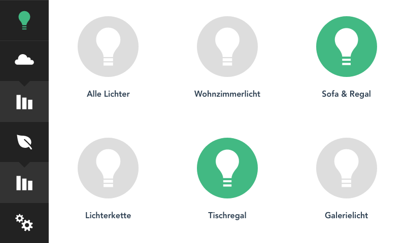
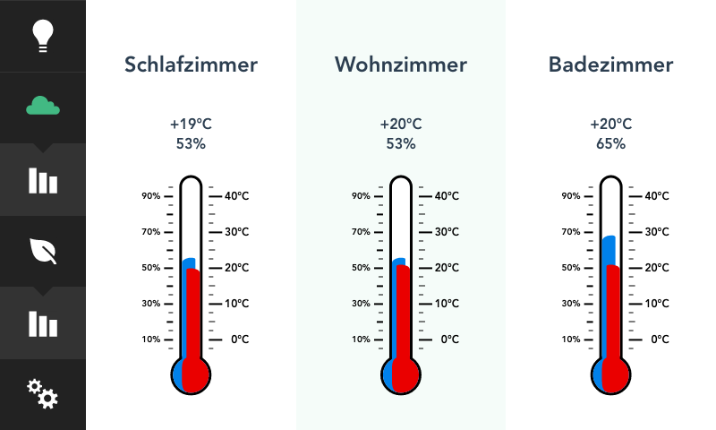
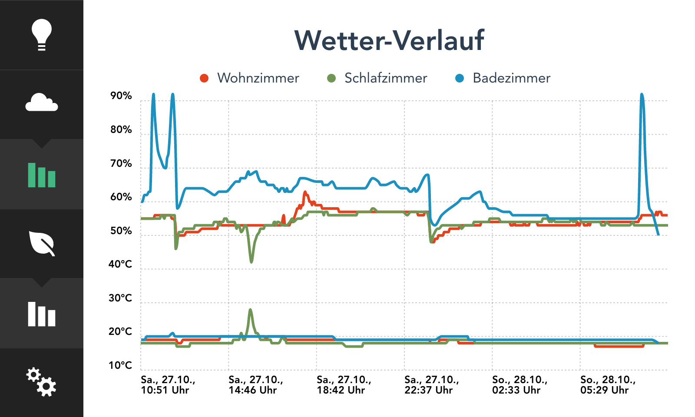
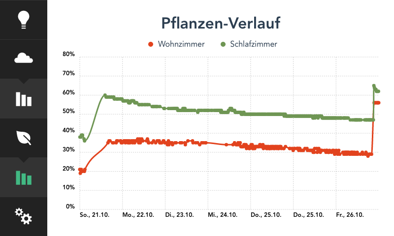
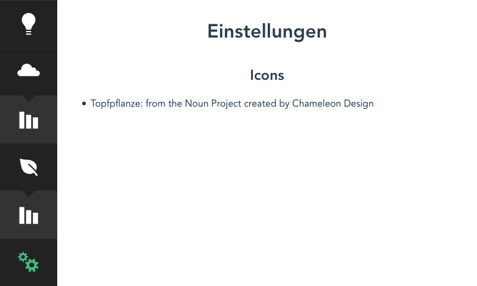

# Smart Home Frontend 

This application is the frontend part and talks to the Smart Home Backend via WebSockets.  
The UI is designed to run on a 5" touch display (800&times;480px) attached to a RaspberryPi.

## Views

### Lights

Display and toggle light state.



### Weather

Display the current weather for every client.



#### Charts

Display the weather data of the last 24 to 30 hours.



### Plants

Display the current moisture level.


#### Charts

Display the moisture level of the last seven days.



## Settings

Open for further development.



## Installation

1. Run ``npm install && npm run build``
1. Optional: Deploy to the production system
1. Install screen via ``sudo apt-get install screen``
1. Open named screen session ``screen -S client``
1. Start the backend app that should be available at http://localhost:3000
1. Run ``DISPLAY=:0 chromium-browser http://localhost:3000 --kiosk --noerrdialogs --disable-translate --no-first-run --fast --fast-start --disable-infobars --disk-cache-dir=/dev/null`` on the production system
1. Leave session with ``strg+a d`` and reattach with ``screen -r client``

## Development

```
npm install
```

### Compiles and hot-reloads for development
```
npm run serve
```

### Compiles and minifies for production
```
npm run build
```

### Run your tests
```
npm run test
```

### Lints and fixes files
```
npm run lint
```

### Run your unit tests
```
npm run test:unit
```
